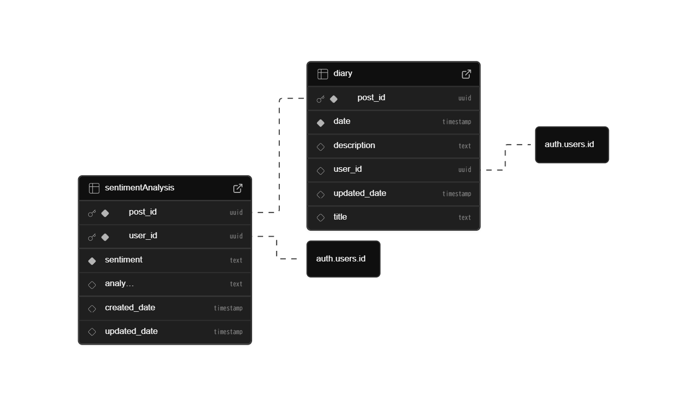

# AI分析日記アプリ
## 🎯プロダクトの目的

日記を書いて、その日の出来事や感情を整理するだけで終わらせるのではなく、AIにも分析してもらいましょう！

わざわざ自分で感情を整理して、日記に記入する必要はありません。
その日の出来事や思いを書くだけで、AIが感情や出来事を整理します。

複雑な感情を客観的に評価してもらうのも良いし、日記を要約して、何があったか分かりやすくまとめることもできます。

日記からAIで自分の行動や感情を振り返って、貴方の助けとなるようなアプリを目指します！

## 🚧現在のステータス

鋭意制作中

- Supabase セットアップ：完了
- テーブル作成：完了
- 認証（ログイン/サインアップ/ログアウト）：100%
- ホーム画面：0%
- 日記作成画面：0%
- 分析結果DB格納：0%
- 過去の日記詳細画面：0%

## 📝直近の TODO（詳細は Issues を参照）
- ホーム画面にリスト形式で、過去の日記を確認できる
- 日記を作成する画面を作成し、Supabaseに内容を投稿できる
- ホーム画面から過去の日記を確認することで、AIの分析結果を確認できる

詳細は Issues に記載しています

## 🛠 使用技術
- Flutter 3.10+
- Riverpod
- Supabase（Auth / Database）
- Dart

## 📚 画面構成 & ER 図
