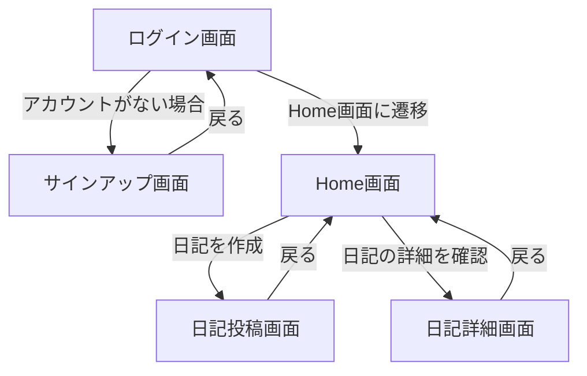
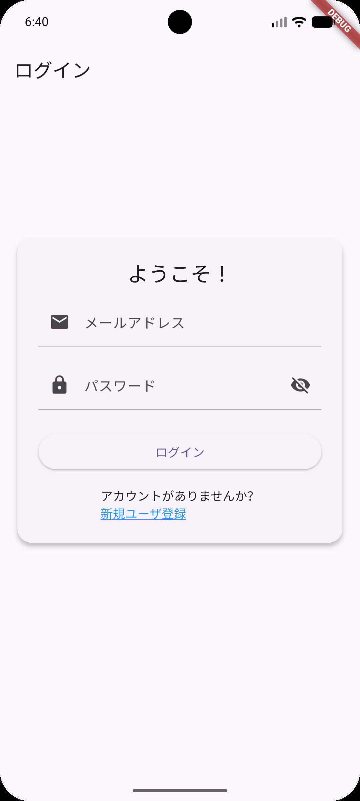
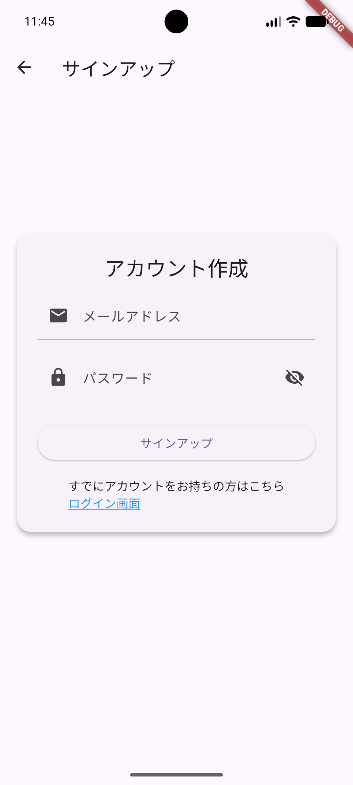
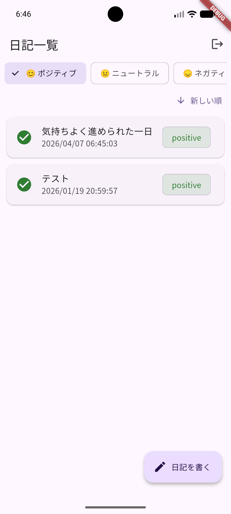
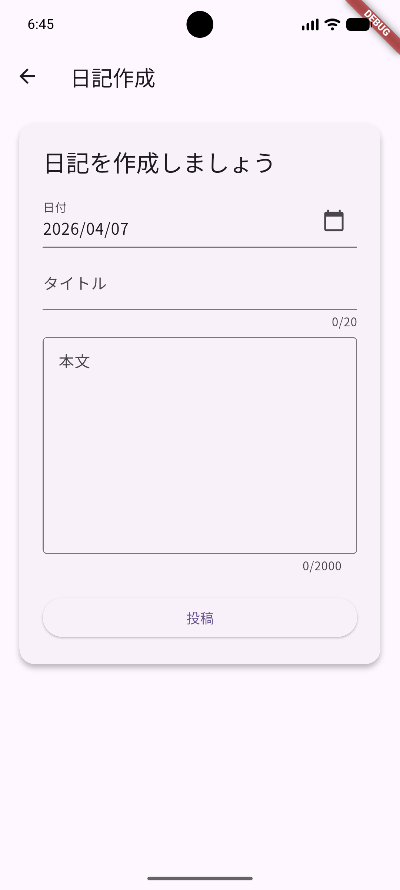
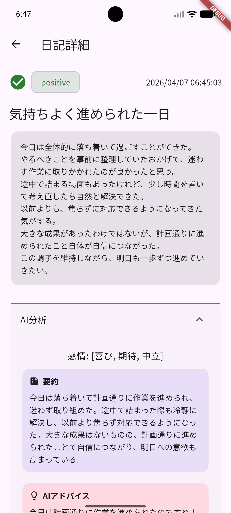
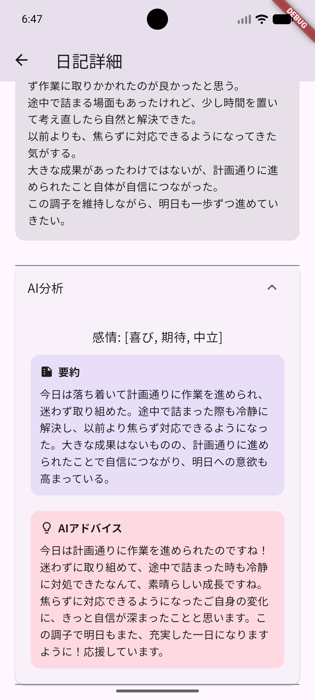
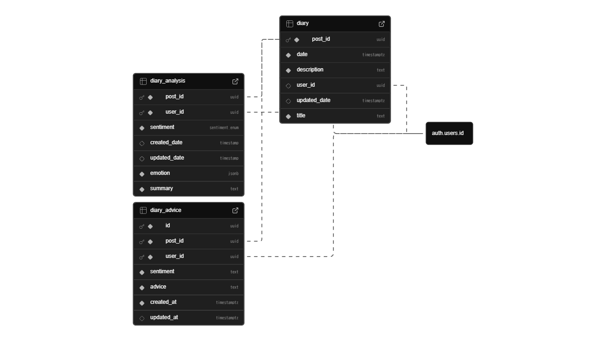

# AI分析日記アプリ
## 🎯プロダクトの目的

日記を書いて、その日の出来事や感情を整理するだけで終わらせるのではなく、AIにも分析してもらいましょう！

わざわざ自分で感情を整理して、日記に記入する必要はありません。
その日の出来事や思いを書くだけで、AIが感情や出来事を整理します。

複雑な感情を客観的に評価してもらうのも良いし、日記を要約して、何があったか分かりやすくまとめることもできます。

日記からAIで自分の行動や感情を振り返って、貴方の助けとなるようなアプリを目指します！

## 🚧現在のステータス
Version 1.0.0 リリース完了

### Webアプリ
https://flutter-ai-therapy-diary.web.app/
### Androidアプリ
準備中...
### iOSアプリ
準備中...

## アプリの実行方法
- ライブラリをインストール
```bash
flutter pub get 
```
- アプリをビルド

アプリビルド時に`--dart-define`の引数を指定する。それぞれ４つの項目を指定する

| Key | Value |
| --- | --- |
| SUPABASE_URL | バックエンドで使用するSupabaseのプロジェクトURLを指定 |
| SUPABASE_API_KEY | SupabaseのAPIキーを指定 |
| SENTRY_FLUTTER_DSN | SENTRYのDSNを指定 |
| SENTRY_ENVIRONMENT | "production"固定 |

```bash
flutter run --flavor prod --dart-define=SUPABASE_URL=https://xxxxx --dart-define=SUPABASE_API_KEY="xxxxx" --dart-define=SENTRY_FLUTTER_DSN="https://xxxxx" --dart-define=SENTRY_ENVIRONMENT="production"
```

## 📝直近の TODO
詳細は Issues に記載しています

## 🛠 使用技術
- Flutter 3.38.9
- Dart 3.10.8
- Riverpod
- Supabase（Auth / Database）
- Firebase
- SENTRY

## 📚 画面構成

```mermaid
flowchart TB
    login[ログイン画面]
    signUp[サインアップ画面]
    home[Home画面]
    createDiary[日記投稿画面]
    detailDiary[日記詳細画面]
    
    login -- アカウントがない場合 --> signUp
    signUp -- 戻る --> login
    login -- Home画面に遷移 --> home
    home -- 日記を作成 --> createDiary
    createDiary -- 戻る --> home
    home -- 日記の詳細を確認 --> detailDiary
    detailDiary -- 戻る --> home
```
### ログイン画面

### サインアップ画面

### Home画面

### 日記投稿画面

### 日記詳細画面


## 📈 ER 図
